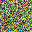
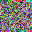

# Denoising Diffusion Probabilistic Models
In this project, I implement a denoising diffusion model as presented in the paper [Denoising Diffusion Probabilistic Models](https://arxiv.org/pdf/2006.11239.pdf). I train diffusion models on the CIFAR10 dataset and Celeba-HQ 32 $\times$ 32 datasets.

## References
[Denoising Diffusion Probabilistic Models](https://arxiv.org/pdf/2006.11239.pdf)\
[Diffusion Models: A Comprehensive Survey of Methods and Applications](https://arxiv.org/pdf/2209.00796.pdf)

## Configuration
Create a python environment:
```
python3 -m venv <env-name>
```

Activate the environment:
```
source <env-name>/bin/activate
```

Install the depencies:
```
pip install -r requirements.txt
```

## Training
In order train the diffusion model, use the following CLI command:
```
python3 train.py <model-config> <training-config>
```
Where `<model-config>` is the YAML file containing the model's parameters. See [model-config-example](model_configs/celebahq32.yaml) for a example. And `<training-config>` is the YAML file containing the training parameters. See [training-config-example](training_configs/example.yaml) for an example.

## Image Generation
### Simple generation
In order to generate a new image, use the following CLI command:
```
python3 gen.py image <model-config> <model-weights> --image_shape C H W
```
Where `<model-config>` is the YAML file containing the the model's parameters, `<model-weights` is the file containing the model's weigths. The `--imag_shape` as its name suggests is there to specify the image's size. `C` is a placeholder for the image's number of channels. 3 for RGB images and 1 for gray scale images. H and W are placeholderd for respectively the height and the width of the image. You should use the same image format as the training images otherwise you might get unexpected results.

### Image generation with video of the generation process
In order to generate a new image and have the video of the generation process, use the following CLI command:
```
python3 gen.py video <model-config> <model-weights> --image_shape C H W
```
This command will generate a new image as the previous command and the video of the generaave as `out.mp4` in the current directory.

Some generation examples:<br/>




